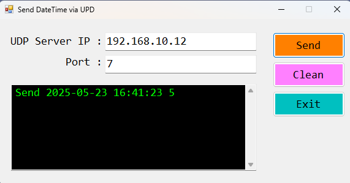

# UDP_Send_DateTime

## Description

**UDP_Send_DateTime** is a simple C# console application written with **Visual Studio 2022**.  
It sends the current system **date and time** via **UDP** to a specified IP address and port.

This project is useful for testing or debugging **STM32H7-based RTC (Real-Time Clock)** firmware or UDP communication handling.

## Features

- Sends current date and time in format `yyyy-MM-dd HH:mm:ss`
- Uses UDP protocol
- Easy to configure and extend

## Usage

1. Build the project with Visual Studio 2022.
2. Run the program ¡V it will send the current timestamp via UDP.

## Example Output

